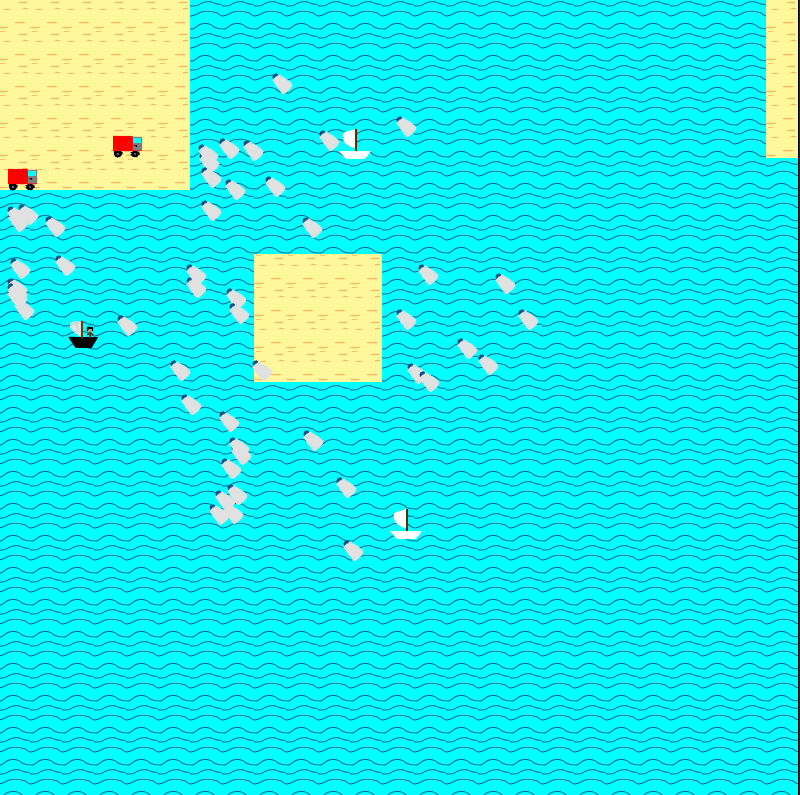

# The Green Pirate
A C++ & SDL2 implementation of Conway's Game of Life.
# The game
The goal is to collect all the trash, and stop the opponents from depositing the trash into the sea. The game has 3 levels.

# The controls

- Arrow keys for movement
- Space key for shooting opponents
- V key for deploying a land vehicle
- B key for stowing the vehicle on board
- Left click - revives the cell.
- Right click - kills the cell.

---

---